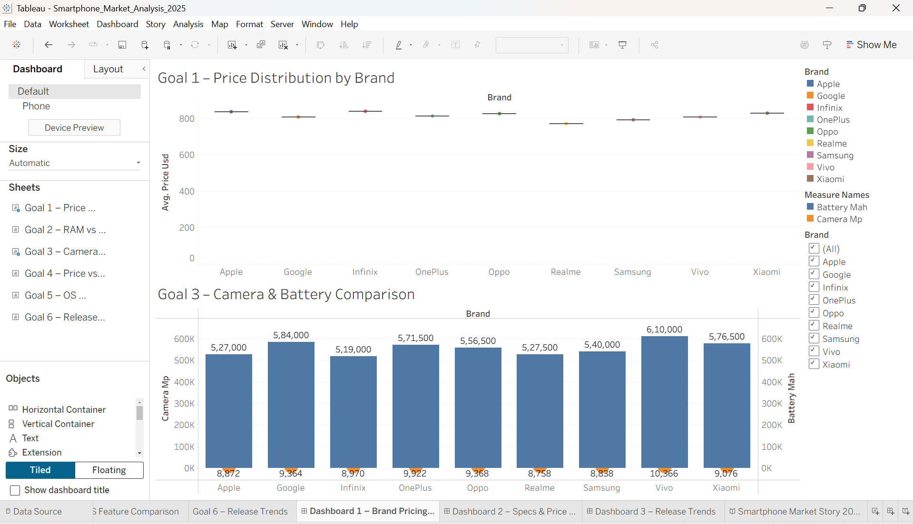
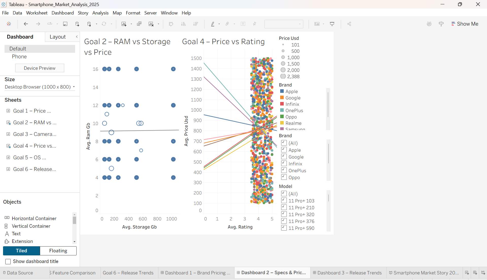
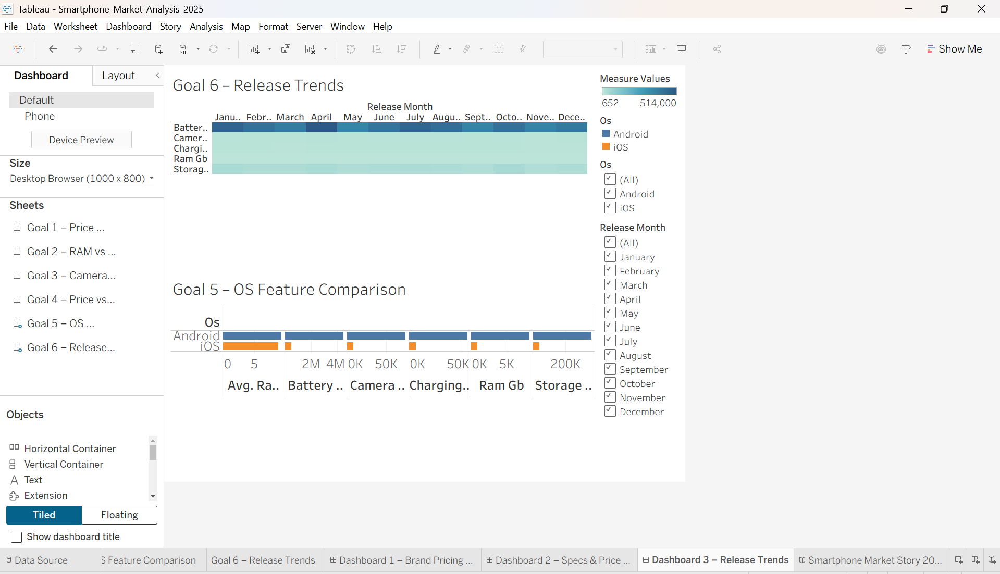

Global Smartphone Market Analysis 2025
Master's Data Visualization Final Individual Project | December 2025
An interactive Tableau data visualization project analyzing the 2025 global smartphone market using a dataset of 1,000 smartphone records and 15 attributes. The project explores smartphone pricing, hardware specifications, user ratings, operating systems, and release trends through six analytical worksheets, three dashboards, and a Tableau story.
> **Academic Context:** Completed as my Master's Data Visualization final individual project in December 2025. I earned an **A grade in the Data Visualization course**.
---
Project Overview
The global smartphone industry is shaped by rapidly changing technology, consumer expectations, and intense competition among manufacturers. This project was created to explore how smartphone specifications and market characteristics relate to pricing and product positioning in 2025.
The analysis focuses on questions such as:
How does average smartphone pricing vary across brands?
How are RAM and storage related to price?
How do camera and battery specifications compare across brands?
What relationship exists between price and user rating?
How do Android and iOS devices differ across major hardware features?
How do smartphone specifications vary across release months?
The goal was to transform a raw smartphone dataset into clear, interactive visualizations that support comparative analysis and market-level insights.
---
Dataset
Dataset: World Smartphone Market 2025
Source: Kaggle
Provider: `shahzadi786`
Records: 1,000
Columns: 15
Domain: Mobile Technology / Consumer Electronics
Dataset Link: https://www.kaggle.com/datasets/shahzadi786/world-smartphone-market-2025
Dataset Fields
The dataset contains the following attributes:
Field	Description
`brand`	Smartphone manufacturer
`model`	Smartphone model
`price_usd`	Price in U.S. dollars
`ram_gb`	RAM capacity in GB
`storage_gb`	Internal storage in GB
`camera_mp`	Camera resolution in megapixels
`battery_mah`	Battery capacity in mAh
`display_size_inch`	Display size in inches
`charging_watt`	Charging power in watts
`5g_support`	5G support status
`os`	Operating system
`processor`	Processor type
`rating`	User rating
`release_month`	Release month
`year`	Release year
---
Tools & Technologies
Tableau Desktop — data visualization, interactive worksheets, dashboards, filters, trend analysis, and story creation
Microsoft Excel — data cleaning, validation, formatting, and preliminary data inspection
GitHub — project documentation and portfolio presentation
---
Data Cleaning
The dataset was prepared in Microsoft Excel before visualization in Tableau.
Key cleaning steps included:
Checked for and removed duplicate records.
Trimmed leading and trailing spaces in text fields.
Standardized the `5g_support` field to consistent Yes/No values.
Converted numerical fields to appropriate numeric formats.
Checked for invalid values such as zero or negative prices and RAM values.
Checked critical fields for missing values.
Standardized categorical values for consistent grouping and analysis in Tableau.
---
Tableau Analysis
The workbook contains six analytical worksheets.
1. Price Distribution by Brand
Compares average smartphone prices across brands to examine market positioning and differences in pricing.
2. RAM vs Storage vs Price
Uses a scatter-based visualization to explore the relationship between memory configuration and smartphone pricing.
3. Camera & Battery Comparison
Compares camera and battery specifications across smartphone brands to identify differences in hardware configurations.
4. Price vs Rating
Analyzes the relationship between smartphone price and user rating using individual model observations and trend lines.
5. OS Feature Comparison
Compares Android and iOS devices across major specifications including RAM, storage, battery capacity, camera capability, and charging power.
6. Release Trends
Uses a heatmap-style view to examine how smartphone specifications vary across release months.
---
Dashboards
Dashboard 1 — Brand Pricing Overview
Combines brand-level pricing analysis with camera and battery comparisons to provide a high-level view of smartphone brand positioning.

---
Dashboard 2 — Specs & Price Relationships
Brings together RAM, storage, price, and rating analysis with interactive filters to explore specification and pricing relationships at the model level.

---
Dashboard 3 — Release Trends
Combines release-month trends with operating-system feature comparisons to highlight changes in smartphone specifications and platform differences.

---
Tableau Story
The project also includes Smartphone Market Story 2025, a multi-step Tableau story that presents the analysis as a connected narrative covering market overview, brand pricing, specifications, ratings, operating systems, release trends, and a final conclusion.
Final Conclusion

---
Key Findings
The Tableau story summarizes several market-level observations from the analysis:
Smartphone brands show different pricing and product-positioning patterns.
RAM and storage configurations are important dimensions when comparing smartphone pricing.
Camera and battery specifications vary across manufacturers.
Price and user rating do not move uniformly across every smartphone model, making model-level comparison important.
Android devices show broader hardware configuration diversity, while iOS represents a more standardized product ecosystem in the dataset.
Smartphone releases and specifications show variation across months, supporting analysis of product-release cycles.
---
Project Structure
```text
Smartphone-Market-Analysis-Tableau/
│
├── README.md
│
├── data/
│   └── Smartphone_Market_Cleaned.xlsx
│
├── documentation/
│   └── Smartphone_Market_Analysis_Report.docx
│
├── images/
│   ├── brand_pricing_overview.png
│   ├── specs_price_relationships.png
│   ├── release_trends.png
│   └── smartphone_market_conclusion.png
│
└── tableau/
    └── Smartphone_Market_Analysis_2025.twbx
```
> File names in the repository may vary slightly from the names shown above if the original project files were preserved.
---
How to View the Tableau Project
Download the `.twbx` file from the `tableau/` folder.
Open it using Tableau Desktop.
Navigate through the six worksheets, three dashboards, and the Smartphone Market Story 2025 tabs.
Use the available filters to explore brands, models, operating systems, and release months.
The `.twbx` packaged workbook contains the Tableau workbook and its associated data source, allowing the project to be opened as a complete Tableau package.
---
Skills Demonstrated
Tableau
Microsoft Excel
Data Cleaning
Data Preparation
Data Visualization
Dashboard Development
Exploratory Data Analysis
Comparative Analysis
Trend Analysis
Scatter Plots
Dual-Axis Visualizations
Heatmaps
Interactive Filters
Tableau Stories
Data Storytelling
---
Academic Context
Program: Master's Degree
Course: Data Visualization
Project Type: Final Individual Project
Completed: December 2025
Course Grade: A
---
Author
Sohitha Mallina
This repository is part of my data analytics and business analysis portfolio and demonstrates my ability to clean data, design Tableau visualizations, build interactive dashboards, and communicate findings through data storytelling.
